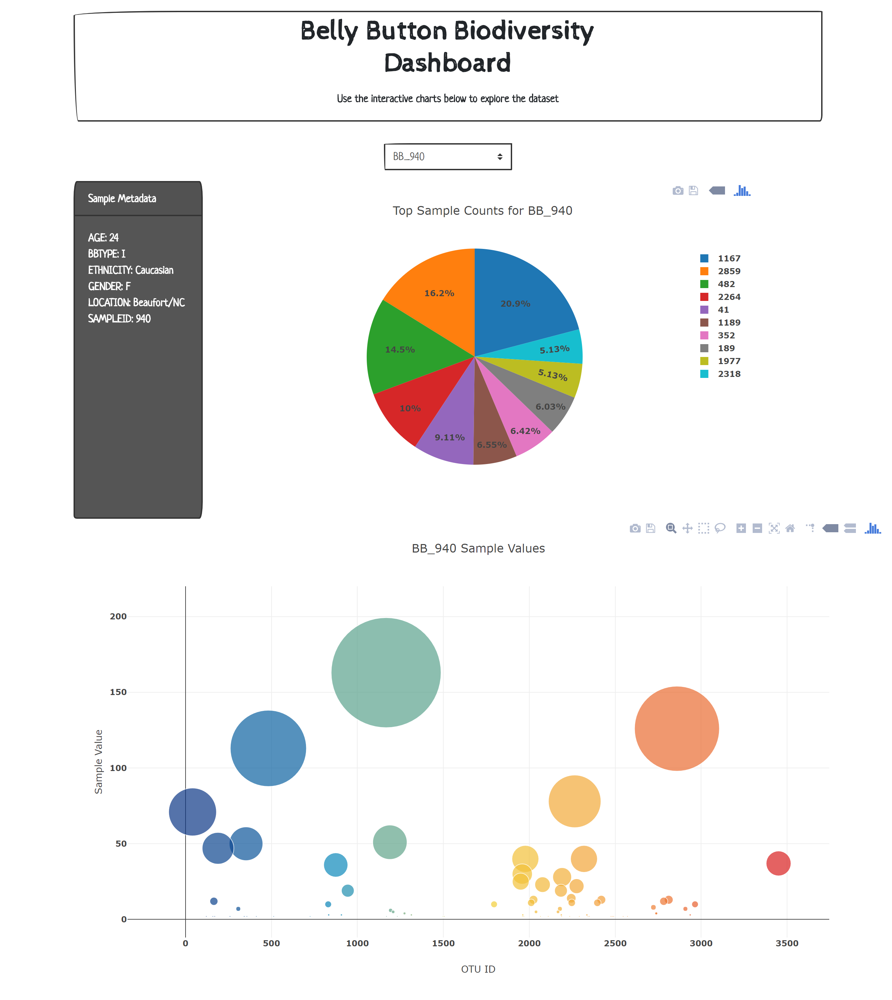

## Belly Button Biodiversity Dashboard

## Deployed on Heroku: https://dashboard-biodiversity.herokuapp.com/

### Build an interactive dashboard to explore the Belly Button Biodiversity DataSet
* Use Flask to design an API for the dataset and to serve the HTML and JavaScript required for the page
* Use SQLAlchemy within the flask app
* Use Plotly.js to build interactive pie and bubble charts with hover text
* When a new sample is selected, the charts update

